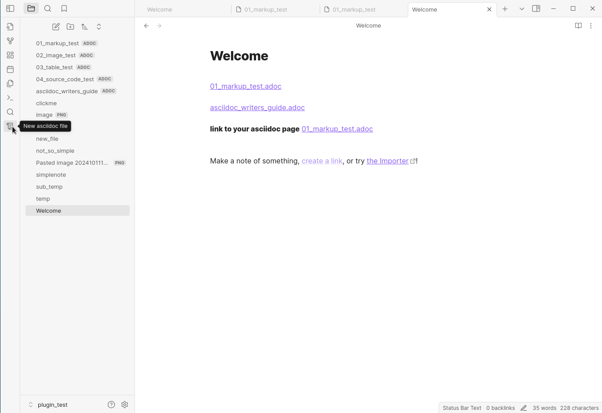

# Obsidian Asciidoc editor plugin

A PoC plugin that allows you to edit and view documents in the asciidoc language

The plugin supports view and edit modes (switching the mode with `ctrl+e` hotkey). Substring search in document is partially supported.

Global search is not supported due to the limitations of the Obsidian API (however, you can use the omnisearch plugin https://github.com/scambier/obsidian-omnisearch)

## preview

## How to use

- Clone this repo.
- Make sure your NodeJS is at least v16 (`node --version`).
- `npm i` or `yarn` to install dependencies.
- `npm run dev` to start compilation in watch mode.

## Manually installing the plugin

- Copy over `main.js`, `styles.css`, `manifest.json` to your vault `VaultFolder/.obsidian/plugins/your-plugin-id/`.
